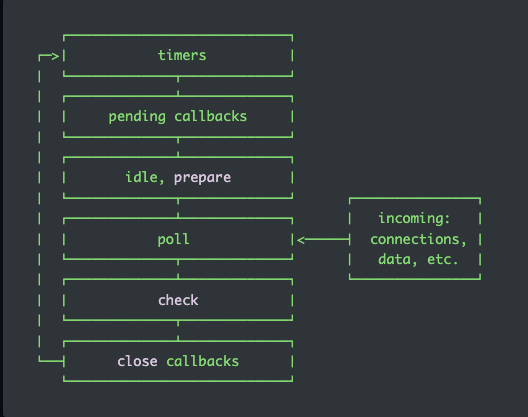

## node event loop

## 浏览器个 node 的事件循环的不同

- 异步的 API 不同
  - node
    > node 自带的 fs http setTimeout setInterval setImmediate...
  - brower
    > setTimeout setInterval 事件 ajax io 操作
  
- 异步队列不同

  - node

    > node 的事件循环有 6 个阶段,每个阶段都有回调队列,分别去处理不同的事件

     

    
  
  - brower
    > 只有一个异步队列 处理事件的回调

#### node中特殊的API

- `setImmediate` 

  >  该API的执行时机 ,在io 操作中(fs.readFile()...) 早于 setTimeout;
  >
  >   收到系统运行的影响, 当不在IO操作中时候,不能确定那个函数的回调先执行                           

#### 不属于异步队列的API

- `process.nextTick` `promise` 属于`next Tick Queue`

  > Tick : 当事件循环在执行栈与异步队列之间每循环一次,就叫做一个tick.
  >
  > ​        node中的task queue 的每一个阶段在执行前,都会先检查 next tick queue里面有无任务.
  >
  > nextTick promise属于 `next Tick Queue` 执行的优先级比较高.
  >
  > `process.nextTick`  的优先级 高于 `promise` 

#### Key point

- Node 中的事件循环是复杂的; node的事件循环在调用栈和回调队列间协同工作
- node 事件循环有多个回调队列
- 不要阻塞事件循环(优先选择异步事件)
- 不要使事件循环没事干(starve) 比如在`process.nextTick` 中使用 递归
- 混用 setTimeout setImmediate process.nextTick promises时 需要当心.

```js
const firstTimeout = () => console.log("timer 1");
const secondTimeout = () => {
  console.log(" timer 2");
  process.nextTick(firstNextTick);
  process.nextTick(secondNextTick);
};
const thirdTimeout = () => {
  console.log("timer 3");
};

const firstNextTick = () => console.log(" nextTick 1");
const secondNextTick = () => console.log(" nextTick 2");
const thirdNextTick = () => console.log(" nextTick 3");

setTimeout(firstTimeout, 0);
setTimeout(secondTimeout, 0);
setTimeout(thirdTimeout, 0);
process.nextTick(thirdNextTick);

// 控制台输出的顺序
//  nextTick 3 ; timer 1 ; timer 2; nextTick 1; nextTick 2; timer 3;
// 总结: nextTick的执行时机高于timer


```

```JS

// promise 和 nextTick的混用

const promiseCallback1 = () => console.log(" promise cb 1");
const promiseCallback2 = () => console.log(" promise cb 2");
const promiseCallback3 = () => console.log(" promise cb 3");

const processNextTickCallback1 = () => console.log("next tick cb 1");
const processNextTickCallback2 = () => console.log("next tick cb 2");
const processNextTickCallback3 = () => console.log("next tick cb 3");

Promise.resolve().then(promiseCallback1);
Promise.resolve().then(promiseCallback2);
Promise.resolve().then(() => process.nextTick(processNextTickCallback2));
Promise.resolve().then(() => process.nextTick(processNextTickCallback3));
Promise.resolve().then(promiseCallback3);
process.nextTick(processNextTickCallback1);


// 输出结果
next tick cb 1
 promise cb 1
 promise cb 2
 promise cb 3
 next tick cb 2
 next tick cb 3

// 结论: 不混用时 nextTick的优先级高  混用时候,按照加入tick queue中的顺序执行
```

#### 阻塞的风险

if a timer expires later during the time when one of the other phases are being processed well  then the callback of that timer will only be called as soon as the event loop comes backs to this first phase .make

Sense and it works like this in all phases so callbacks in each queue are processed one by one until there are no ones left in the queue and only then the event loop will enter the next phase

setImmediate is special kind of timer that we can use if we want to process callbacks immediately  after the i/o polling and execution  phase which can be important advanced usage 

Macir task queue / nextTick queue  if there are any callbacks in one of these two queues to be processed they will be executed right after the current phase of the event loop finished instead of waiting for the entire loop to finish 


and the tick is basically one cycle  in this event  loop 

#### timer

-  定时器的回调将在指定的时间过后,尽可能早的运行;但是操作系统 可能会延迟它们
- Poll phase 控制者定时器何时执行

### timer 与其他异步事件的区别

- timer是等到时间后,才回去执行回调函数
- 类似于fs等,都是只要当前的异步操作有结果,就回去执行回调函数

#### `setImmediate()` vs `setTimeout()`

- setImmediate 被设计去执行一些当轮训阶段完成后的任务
- setTimeout 当事件到达后采取执行回调函数
- timer的执行顺序收到调用它们的上下文 ,假如都是在主模块中被调用, timer将受到进程性能的影响.

#### pending callbacks

- 执行系统错误的回调

#### Poll

- 轮训阶段会有两种主要的函数
  -  计算阻塞的时间 和 io 的轮训
  - 处理轮训队列的事件
- 当事件循环进入到轮训阶段, 没有timer被调度时, 会发生两件事
  -  轮训队列非空,事件循环迭代 Poll的回调队列,同步执行每一项任务直到poll的队列已经被执行完,或者达到系统上线.
  - poll queue isempty 
    - Script  scheduled by setImmediate();  event loop 结束poll阶段的轮训,检查下一阶段执行被调度的脚本. 既执行被setImmediate调度的脚本.
    - 没有script 被setImmediate 调度; 事件循环等待被加入到队列中的回调函数,立即执行它们.

​		**一旦poll阶段的队列是空的,事件循环回去检查已经到时间的timer, 当timer的时间到期后, 事件循环就返回timer阶段去执行timer的回调函数.**

#### check

- 当poll阶段被执行完成后, 这个阶段的回调函数会立即执行.
- 如果轮询阶段变为空闲并且脚本已使用 setImmediate() 排队，则事件循环可能会继续到检查阶段而不是等待。
- setImmediate() 实际上是一个特殊的计时器，它在事件循环的单独阶段运行。(它使用一个 libuv API 来安排在轮询阶段完成后执行的回调)。

#### close callbacks

- the `'close'` event will be emitted in this phase. 
